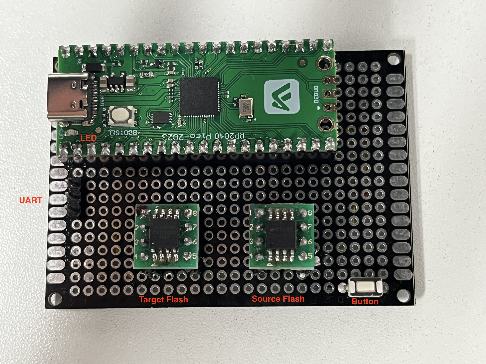

# Raspberry Pico Flash Copier



* It copy data from the source flash to the target flash.
* For the data to be copied, compare them according to the 4KB size. If the data does not match, copy it.
* Enter cpf in the serial terminal to copy all the data in the source flash to the target flash.
* Press the button to copy the data from offset 0x100000 to 0x300000 in the source flash to the target flash.

## The Circuit Connection

**For target flash**

| PICO | FLASH |
| ---- | ----- |
| GP3  | DI    |
| GP4  | DO    |
| GP2  | CLK   |
| GP6  | CS    |

**For source flash**

| PICO | FLASH |
| ---- | ----- |
| GP15 | DI    |
| GP12 | DO    |
| GP14 | CLK   |
| GP11 | CS    |

**For Button**

GP17 **=>** BUTTON **<=** GP18

## Compilation method

**Compilation environment**: ubuntu20.04

**NOTE**: 

* This project is based on rt-thread. Before executing the following steps, please make sure that the env environment of rt-thread has been configured: https://github.com/RT-Thread/env
* The following packages are required: scons gcc-arm-none-eabi libncurses5-dev

```shell
git clone git@github.com:skkily/raspberryPico_FlashCopier.git
cd raspberryPico_FlashCopier
./start.sh
cd ./Pico_flashCPR/bsp/raspberry_pico/
source ~/.env/env.sh
pkgs --update
scons
```

**Output firmware**: ./rtthread-pico.uf2
